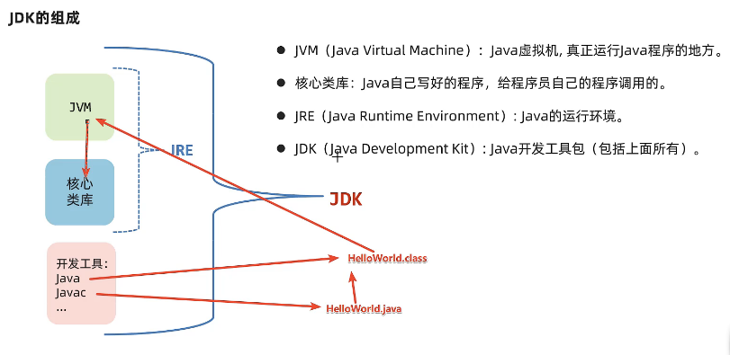
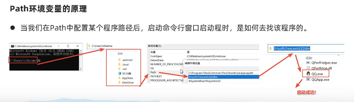
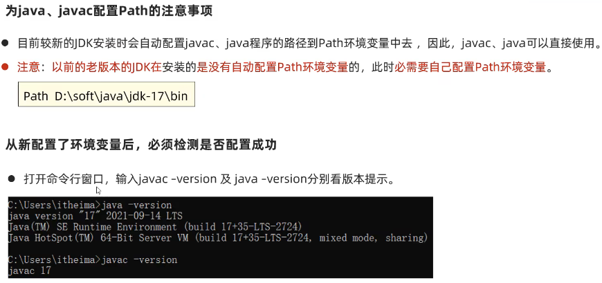
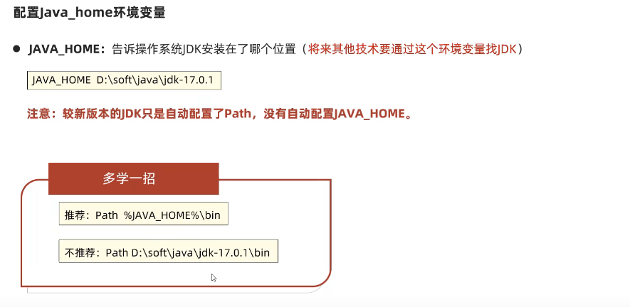

## java入门

- java搭建开发环境：

  - > JDK: java development kit java开发展工具包 
    >
    > LTS: long-term support 长期支持版本
    >
    > oracle官网下载
    >
    > https://www.oracle.com/cn/java/
    >
    > ```java
    > terminal查看java的版本
    > java -version
    > javac -version
    > 
    > java.exe 执行工具
    > javac.exe 编译工具
    >   
    > ```
    >
    > ```java
    > windows 下
    >   cls清理屏幕
    >   D: 选择d 盘
    >   dir 查看d盘下的目录 
    >   cd 
    >   cd ..回退上一级目录
    >   
    > ```
    >
    > 

- java程序的执行原理

  > 1. 高级编程语言 --> 机器语言
  > 2. 

- 

- **java： JDK组成，跨平台原理**

> **1.JVM （Java Virtual Machine）**: java 虚拟机，真正运行java程序的地方
>
> ```java
> public class HelloWorld {
>     public static  void main(String[] args){
>         System.out.println("Hello world");
>     }
> }
> ```
>
> **2.核心类库**：*java自己写好的程序，给程序员自己的程序调用的*
>
> **3.jvm+核心类库 == JRE**：  *JAVA runtime Environment: java的运行环境*
>
> **4.开发工具： java/javac** 
>
> ----
>
> 以上所有组成 jdk（java开发工具包）： java development kit
>
> 

> Java的跨平台
>
> - 一次编译，处处可用
> - 只需要开发一次，就可以在各种安装了jvm的平台上运行

- JDK安装后Path和Java_home环境变量

  - Path 环境变量用于记住程序路径，方便在命令行窗口的任意目录启动程序
  -  
  - 
  - > 
    >
    > ---
    >
    > 

- 配置java_home环境变量

- >java_home:  告诉操作系统jdk安装在哪个位置，（将来其他技术通过这个环境变量找jdk）
  >
  >
  >
  >


- java的IDEA开发工具